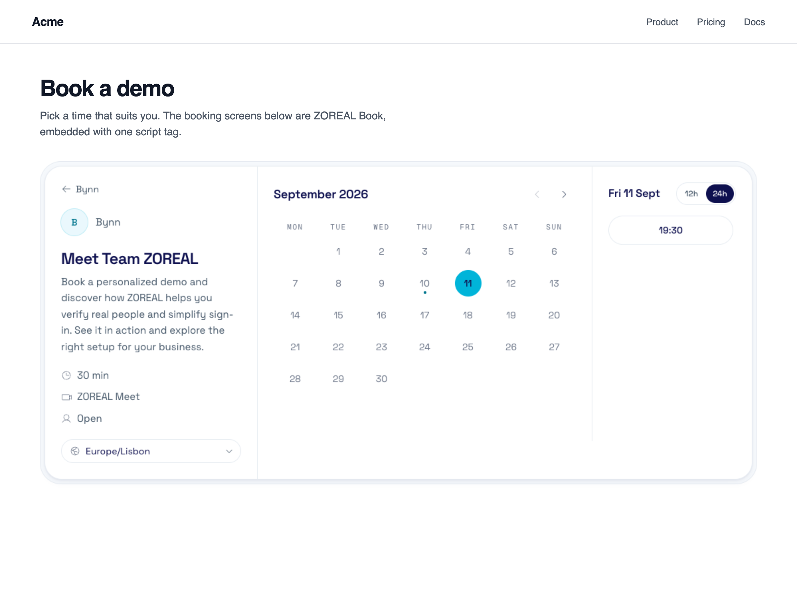
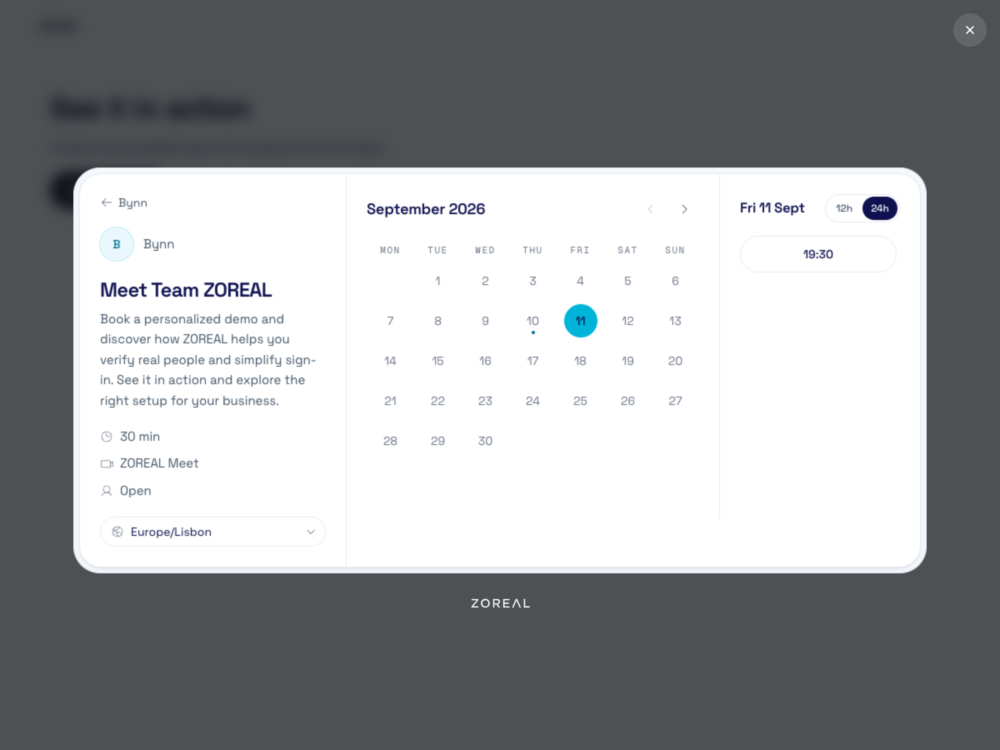
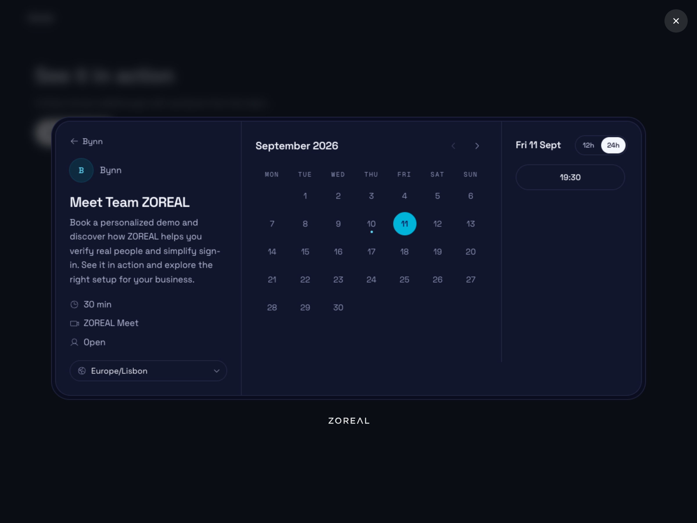

# @zoreal/book-react

[](https://www.npmjs.com/package/@zoreal/book-react) [](https://www.npmjs.com/package/@zoreal/book-react) [](https://github.com/Bynn-Intelligence/zoreal-book-react/actions/workflows/ci.yml) [](https://scorecard.dev/viewer/?uri=github.com/Bynn-Intelligence/zoreal-book-react) [](./LICENSE)

ZOREAL Book inside your own React app: the booking screens in an iframe your
page cannot read and that cannot read your page, as a component, a provider and
two hooks.

One component to render, one hook for the imperative bits, one hook for the
events. ESM and CJS, typed, and no runtime dependency beyond the core package
it wraps.

```
@zoreal/book-react (this package)   the component, the provider, the hooks
@zoreal/book-js                     the frame, the channel, the events
book.zoreal.com/embed.js            the same thing as one script tag
```

## What ZOREAL Book is

Book is scheduling without the back and forth. You define the kinds of
appointment people can book with you, and a guest picks a free slot from a
calendar that never overlaps your real one.

Book is part of **ZOREAL Meet**, not a separate product. A booking that ends in
a call ends in a Meet room, and a booking that does not still lives on the same
calendar as your calls. You will find Book in the Meet section of your account,
alongside Calendar, Events and Availability.

What makes it different from other schedulers is the **requirement** you can set
per kind of appointment:

| Requirement | What the guest must do | Use it for |
|---|---|---|
| `open` | Give a name and an email, verified with a six-digit code | Ordinary demos, most public booking |
| `verified_human` | Prove they are a live human with ZOREAL ID, no name disclosed | Anything you do not want automated or spammed |
| `verified_identity` | Disclose their verified legal name | Consultations, clinics, regulated work |

The requirement is yours to choose per event type. The embed can neither raise
nor lower it, which is the point: your page cannot talk a guest past your own
rule.

## What it looks like

Inline, where the component renders, on a host page with its own header and copy. The
screens size themselves to their content and bring their own styles:



As a layer over the page, opened from a button with `book.modal()`. The layer
lives in a shadow root, so the host's CSS cannot reach it and its CSS cannot
leak out:



The same layer with the browser set to dark. Nothing is configured for this:
the page follows the browser's own scheme unless you pin one, and the frame
stays transparent either way:



## Install

```sh
npm install @zoreal/book-react
```

React 18 or 19, as a peer dependency, with `react-dom`. The core embed,
[`@zoreal/book-js`](https://github.com/Bynn-Intelligence/zoreal-book-js), comes
along as an ordinary dependency, so there is nothing else to install and nothing
to load from a CDN.

Not using React? Install [`@zoreal/book-js`](https://github.com/Bynn-Intelligence/zoreal-book-js)
directly. It is framework-free and is what any other framework wrapper is built
on.

## Getting your account and your booking link

1. Create an account at **https://zoreal.com**.
2. Open **Meet**, then **Book**.
3. Set your **availability**: the weekly hours you are bookable, in your time
   zone, plus any date overrides for holidays and days off.
4. Connect a **calendar** if you want your existing busy time respected and your
   bookings written back. Google and Microsoft 365 are supported. A local ZOREAL
   calendar works with no connection at all.
5. Create an **event type**: a title, a length, where it happens, and the
   requirement from the table above.
6. Copy its **link**. It looks like `acme/kwm-drpt`: your handle, then the
   address the server minted for that event type.

That link is the only thing this package needs. There is no API key, no client
id and no secret in the browser, because everything the embed can do is
something a stranger on your hosted page could already do.

**A handle on its own works too.** Pass `acme` instead of `acme/kwm-drpt` and
the frame shows your whole booking page, listing every active event type, and
lets the guest choose.

### Embedding is a paid feature

The package is free to install, because gating a download gates nothing. The
**page** is what checks: on a plan without embedding, the frame renders a short
screen with a button through to the hosted page, and fires `linkFailed` with
`reason: 'embed_not_available'` so your app can fall back to a plain link.
Booking still works; it just happens on the hosted page rather than inside
yours.

## Quick start

```tsx
import { ZorealBook } from '@zoreal/book-react';

export function BookingSection() {
  return <ZorealBook link="acme/kwm-drpt" />;
}
```

That is the whole integration. The component renders a plain `<div>`, mounts the
booking frame inside it after mount, sizes it to its own content so there is
never a scrollbar inside a scrollbar, and takes the frame away again when it
unmounts.

Every other `<div>` attribute you pass lands on that wrapper, so it takes your
`className` and your `style` as normal:

```tsx
<ZorealBook link="acme/kwm-drpt" className="rounded-xl border" style={{ minHeight: 720 }} />
```

Change `link` and the frame is replaced with the new one. Change `config` and
the open frame is updated in place, which is a different thing entirely; see
[Prefill](#prefill).

## ZorealBookProvider

Optional. Wrap the part of your app that books and every embed under it shares
an appearance, instead of each one repeating it.

```tsx
import { ZorealBookProvider } from '@zoreal/book-react';

export function App({ children }) {
  return (
    <ZorealBookProvider ui={{ theme: 'auto', cssVars: { '--zb-accent': '#4c6ef5' } }}>
      {children}
    </ZorealBookProvider>
  );
}
```

| Prop | Purpose |
|---|---|
| `ui` | Appearance for every embed under the provider. Applies to frames already open |
| `origin` | The Book origin. Defaults to the public one. Set it only if you were told to, and set it at the root, before anything books |

The provider holds configuration and nothing else. It creates no frame, opens no
connection, and is safe to mount at the top of a tree that mostly never books.

## The hook: useZorealBook()

`useZorealBook()` hands you the imperative API for a namespace: everything the
core package can do, from inside a component.

```tsx
import { useZorealBook } from '@zoreal/book-react';

function BookDemoButton() {
  const book = useZorealBook();

  return (
    <button type="button" onClick={() => book.modal({ link: 'acme/kwm-drpt' })}>
      Book a demo
    </button>
  );
}
```

The core loads once per page however many components ask for it, so calling this
in ten components costs one script and one set of listeners. Two components
asking for the same namespace get the identical object.

### A layer over your page

```tsx
const modal = book.modal({ link: 'acme/kwm-drpt' });
// modal.close() if you need to close it yourself
// modal.setConfig({ notes: 'From the pricing page' }) to update it in place
```

The page dims and blurs, a ring turns until the times are there, and the
booking card appears at its own size with the close in the corner of the window
and the ZOREAL mark beneath it. Nothing of the SDK's is drawn around the card.
It closes by the close button, the backdrop, the Escape key, or the guest
finishing, and it is as tall as its content, up to the height of the window;
past that the layer scrolls, the frame never does. It is opened outside React's tree and belongs to the page, not
to the component that opened it: closing it is `close()`, not an unmount.

### A floating button

```tsx
useEffect(() => {
  const button = book.floatingButton({
    link: 'acme/kwm-drpt',
    text: 'Book a demo',
    position: 'bottom-right',
    color: '#111827',
    textColor: '#ffffff',
  });
  return () => button.destroy();
}, [book]);
```

### Redirect, and the plain address

```tsx
book.redirect({ link: 'acme/kwm-drpt' });
book.redirect({ link: 'acme/kwm-drpt', target: '_blank' });

// Or just the address, for an ordinary <a href>
const href = book.hostedUrl('acme/kwm-drpt');
```

Redirecting sends the guest to the hosted booking page instead of embedding it.
It is useful when you would rather not take on a third-party frame at all, and
it is the natural fallback when `linkFailed` tells you embedding is not
available.

### Warm it before the click

```tsx
<button
  onMouseEnter={() => book.preload({ link: 'acme/kwm-drpt' })}
  onClick={() => book.modal({ link: 'acme/kwm-drpt' })}
>
  Book a demo
</button>
```

The next `modal()` for the same link adopts the warmed frame, so the screens are
already painted when the layer opens.

### Click-to-open from markup

If you would rather mark up your triggers than write handlers, any element
carrying `data-zoreal-book-link` opens the layer when clicked, including
elements React renders later.

```tsx
<button data-zoreal-book-link="acme/kwm-drpt">Book a demo</button>

<button
  data-zoreal-book-link="acme/kwm-drpt"
  data-zoreal-book-config='{"metadata":{"campaign":"spring"}}'
>
  Book a demo
</button>

<button data-zoreal-book-link="acme/kwm-drpt" data-zoreal-book-mode="redirect">
  Book on our scheduling page
</button>
```

There is nothing to turn on. Any component using `useZorealBook()` or rendering
`<ZorealBook>` binds the delegated listener, once per page however many
components ask.

## Events: useZorealBookEvent()

`useZorealBookEvent(event, handler)` subscribes for as long as the component is
mounted, and unsubscribes when it unmounts.

```tsx
import { useZorealBookEvent } from '@zoreal/book-react';

function BookingAnalytics() {
  useZorealBookEvent('bookingSuccessful', ({ booking }) => {
    analytics.track('Booked', {
      eventType: booking.eventType.slug,
      startsAt: booking.startsAt,
    });
  });

  return null;
}
```

**The handler is held in a ref.** Passing an inline arrow function is the normal
way to use this hook: a new function identity on every render does not
resubscribe, and the handler that runs is always the latest one rendered, so it
never closes over a stale prop or a stale piece of state. You do not need
`useCallback`, and you do not need a dependency array.

The events fire for every embed in the namespace, whichever way it was opened.
One listener component covers the inline embed, the layer your button opened,
and the floating button, all at once.

| Event | Fires when |
|---|---|
| `linkReady` | The link resolved and the screens are usable |
| `linkFailed` | The link did not resolve. Fall back to a plain link |
| `bookingSuccessful` | A booking was made and confirmed |
| `bookingRequested` | A booking was made and is waiting for your approval |
| `rescheduleSuccessful` | An existing booking moved to a new slot |
| `bookingCancelled` | An existing booking was cancelled |
| `identityRequired` | The event type requires proof and the guest has been asked |
| `identityVerified` | The guest passed. Carries the grade only |
| `paymentStarted` | Checkout opened. Payment happens on Stripe's page, never in the frame |

Every booking event carries the same shape:

```json
{
  "booking": {
    "id": "bk_7QK39F2M",
    "eventType": { "slug": "kwm-drpt", "title": "Product demo", "length": 30 },
    "startsAt": "2026-10-01T13:00:00Z",
    "endsAt": "2026-10-01T13:30:00Z",
    "timezone": "Europe/Lisbon",
    "location": "meet_room",
    "status": "confirmed",
    "requirement": "verified_human",
    "metadata": { "lead_id": "L-4471" }
  }
}
```

### What events deliberately do not carry

**No guest name, no guest email, no verified identity.** Your app typed the
prefill if it had it. A booking a stranger makes on your page does not hand you
their details, and a verified identity check tells you it passed, never who
passed it.

If you need the guest's details for your own records, collect them on your own
form first, pass them as prefill, and match the booking back with `metadata`.
That way the data you hold is data the guest gave you, on your own terms.

### Handling a link that does not resolve

```tsx
function BookingFallback({ onFallback }: { onFallback: (href: string) => void }) {
  const book = useZorealBook();

  useZorealBookEvent('linkFailed', ({ link, reason }) => {
    if (reason === 'embed_not_available') onFallback(book.hostedUrl(link));
  });

  return null;
}
```

| `reason` | Means |
|---|---|
| `not_found` | No such handle, or the page was deleted |
| `inactive` | The event type exists but is hidden |
| `embed_not_available` | The host's plan does not include embedding |
| `protocol_unsupported` | This build is older than the page expects. Upgrade the package |

## Prefill

Everything your app already knows about the guest, so they do not type it twice.
Pass it as the `config` prop, or in the options to `modal()`, `floatingButton()`
and the rest.

```tsx
<ZorealBook
  link="acme/kwm-drpt"
  config={{
    name: 'Ada Lovelace',
    email: 'ada@example.com',
    phone: '+351900000000',
    guests: ['colleague@example.com'],
    notes: 'Interested in the enterprise plan',
    answers: { team_size: '50-200' },
    timezone: 'Europe/Lisbon',
    date: '2026-10-01',
    locale: 'en',
    metadata: { lead_id: 'L-4471', campaign: 'spring' },
  }}
/>
```

| Key | What it does |
|---|---|
| `name`, `email`, `phone` | Prefills the guest's details. Never trusted: an `open` event type still verifies the address with a code |
| `guests` | Additional attendees, by email, when the event type allows them |
| `notes` | Prefills the notes field |
| `answers` | Prefills your own questions, keyed by question key |
| `timezone` | IANA zone. Overrides detection |
| `month`, `date`, `slot` | Open on a month, a day, or a chosen slot |
| `locale` | BCP 47 tag. Defaults to the browser's language |
| `metadata` | Up to ten string pairs carried on the booking and returned on every event |

**Prefill never travels in the URL.** The frame is opened bare and the config is
posted to it over the message channel once it reports ready. A name or an email
in a URL ends up in server logs, browser history and referrer headers, and none
of those are places a guest's details belong.

That rule is also why `redirect()` and `hostedUrl()` drop `name`, `email`,
`phone`, `guests`, `notes` and `answers`, and warn in the console when you pass
them. They keep `month`, `date`, `slot`, `locale`, `timezone` and `metadata`,
which describe the appointment rather than the person.

### Config changes update the frame, they do not reload it

A new object literal on every render is the normal way to write React, and it
would be a poor bargain if it tore the booking screens down each time. It does
not. The component compares the config by value:

- Same values, new object identity: nothing happens. The guest keeps their
  place, mid-booking, mid-typing.
- Different values: the new config is posted into the open frame. Same frame,
  same scroll position, updated fields.
- Different `link`: that is a different booking page, so the frame is replaced.

```tsx
// The guest is halfway through choosing a slot. This does not disturb them.
<ZorealBook link="acme/kwm-drpt" config={{ metadata: { lead_id: leadId } }} />
```

### metadata is how you match a booking back to a lead

```tsx
function BookDemo({ leadId }: { leadId: string }) {
  const book = useZorealBook();

  useZorealBookEvent('bookingSuccessful', ({ booking }) => {
    crm.attachBooking(booking.metadata.lead_id, booking.id);
  });

  return (
    <button type="button" onClick={() => book.modal({ link: 'acme/kwm-drpt', config: { metadata: { lead_id: leadId } } })}>
      Book a demo
    </button>
  );
}
```

Ten pairs, strings only, shown to the host, returned to you, never shown to the
guest.

## Appearance, and the styles you do not have to write

Appearance goes on the provider, or on a namespace through the hook:

```tsx
<ZorealBookProvider ui={{ theme: 'auto', hideEventTypeDetails: false, cssVars: { '--zb-accent': '#4c6ef5', '--zb-radius': '10px' } }}>
```

`cssVars` are applied inside the frame, and only names the booking page
publishes are honoured. Anything else is ignored rather than injected.

**The embed brings its own CSS and takes none of yours.** Everything this
package paints on your page lives in a shadow root with its own stylesheet, so a
global `button { }` rule, a CSS reset or a utility framework's preflight cannot
reshape the modal or the floating button. The booking screens themselves are
painted inside the frame, on ZOREAL's origin, so they look the same on every
site that embeds them.

There is **no stylesheet to import** and **no class names to add**. The only CSS
in play on your side is whatever you choose to put on the wrapper `<div>`.

## Namespaces

Two independent embeds on one page, with separate frames, appearance and
listeners. Pass `namespace` to the component, and the same name to the hooks.

```tsx
<ZorealBook link="acme/kwm-drpt" namespace="sales" />
<ZorealBook link="acme/jpy-wkqt" namespace="support" />
```

```tsx
useZorealBookEvent('bookingSuccessful', trackSalesBooking, 'sales');

const support = useZorealBook('support');
```

Without a namespace everything shares the default one, which is what you want
unless you are running two booking surfaces side by side.

## Server-side rendering

Safe by construction, in Next.js, Remix, or anything else that renders on the
server.

The component renders an empty `<div>` and nothing else. The frame is created in
an effect, and effects do not run on the server, so **the frame is never in the
server HTML**: no iframe in the markup, no `window`, no `document`, nothing to
guard. It hydrates on the client and the booking screens appear then.

The hooks are the same story. `useZorealBook()` reaches into the core lazily and
the provider only holds values, so nothing opens a channel or touches the DOM
until the browser is running the code.

## StrictMode

Under React 18 and 19, StrictMode mounts every component twice in development to
surface effects that do not clean up after themselves. This one does: the
teardown removes the frame, so a StrictMode double mount leaves **exactly one
frame**, not two. This is covered by the test suite.

## A worked example

A pricing page with an enterprise plan. The button opens the booking layer,
carries the CRM lead id into the booking, and reports the confirmed booking to
analytics. It also warms the frame on hover, so the layer opens onto painted
screens.

```tsx
import { ZorealBookProvider, useZorealBook, useZorealBookEvent } from '@zoreal/book-react';
import { analytics } from './analytics';
import { crm } from './crm';

const DEMO_LINK = 'acme/kwm-drpt';

function BookDemoButton({ leadId }: { leadId: string }) {
  const book = useZorealBook();

  return (
    <button
      type="button"
      className="btn btn-primary"
      onMouseEnter={() => book.preload({ link: DEMO_LINK })}
      onClick={() =>
        book.modal({
          link: DEMO_LINK,
          config: {
            metadata: { lead_id: leadId, plan: 'enterprise' },
          },
        })
      }
    >
      Book a demo
    </button>
  );
}

function BookingReporter() {
  const book = useZorealBook();

  useZorealBookEvent('bookingSuccessful', ({ booking }) => {
    analytics.track('Demo booked', {
      eventType: booking.eventType.slug,
      length: booking.eventType.length,
      startsAt: booking.startsAt,
      plan: booking.metadata.plan,
    });

    // The event carries no name and no email, by design. metadata is the
    // thread back to the lead your own form already collected.
    crm.attachBooking(booking.metadata.lead_id, booking.id);
  });

  useZorealBookEvent('linkFailed', ({ link, reason }) => {
    analytics.track('Demo booking unavailable', { reason });
    if (reason === 'embed_not_available') window.location.assign(book.hostedUrl(link));
  });

  return null;
}

export function PricingPage({ leadId }: { leadId: string }) {
  return (
    <ZorealBookProvider ui={{ theme: 'auto', cssVars: { '--zb-accent': '#4c6ef5' } }}>
      <section className="plans">
        <article className="plan">
          <h2>Enterprise</h2>
          <p>Single sign-on, audit trails, and a named contact.</p>
          <BookDemoButton leadId={leadId} />
        </article>
      </section>

      <BookingReporter />
    </ZorealBookProvider>
  );
}
```

`BookingReporter` renders nothing and exists only to hold the subscriptions. One
of them covers every booking made anywhere on the page, so adding a second
button later needs no second listener.

## API

Everything this package exports.

| Export | What it is |
|---|---|
| `<ZorealBook />` | The booking screens, inline, in a `<div>` you can style |
| `<ZorealBookProvider />` | A shared origin and appearance for its children |
| `useZorealBook(namespace?)` | The imperative API for a namespace |
| `useZorealBookEvent(event, handler, namespace?)` | One subscription, for as long as the component is mounted |
| `SDK_VERSION` | This package's version, as a string |

Plus the types, re-exported from the core package so an app needs one import:
`Booking`, `BookConfig`, `BookEventMap`, `BookEventName`, `BookNamespace`,
`EventTypeSummary`, `FloatingButtonOptions`, `InlineHandle`,
`LinkFailureReason`, `Location`, `ModalHandle`, `Requirement`, `Theme`,
`UiConfig`.

### `<ZorealBook />`

| Prop | Type | Purpose |
|---|---|---|
| `link` | `string` | Required. `<handle>` or `<handle>/<slug>` |
| `config` | `BookConfig` | Prefill and metadata. Changing it updates the frame in place |
| `namespace` | `string` | An independent embed. Two namespaces on one page never cross |
| any `<div>` attribute | | `className`, `style`, `id`, `aria-*` and the rest land on the wrapper |

### `<ZorealBookProvider />`

| Prop | Type | Purpose |
|---|---|---|
| `ui` | `UiConfig` | `theme`, `cssVars`, `hideEventTypeDetails`, `layout` |
| `origin` | `string` | The Book origin. Defaults to the public one |
| `children` | `ReactNode` | Required |

### What `useZorealBook()` returns

| Call | Returns |
|---|---|
| `book.inline({ link, element, config? })` | `{ destroy(), setConfig(config) }` |
| `book.modal({ link, config? })` | `{ close(), setConfig(config) }` |
| `book.floatingButton({ link, text?, position?, color?, textColor?, config? })` | `{ destroy() }` |
| `book.redirect({ link, config?, target? })` | Navigates |
| `book.hostedUrl(link, config?)` | The hosted page address, as a string |
| `book.preload({ link })` | Warms a frame |
| `book.ui(config)` | The namespace, for chaining |
| `book.on(event, handler)` / `book.off(...)` | The namespace, for chaining |
| `book.init({ origin? })` | The namespace, for chaining |
| `book.destroy()` | Tears the namespace down |

`<ZorealBook />` is `inline()` with the lifecycle handled for you, and
`useZorealBookEvent()` is `on()` and `off()` with the same. Reach for the raw
calls when you need a layer, a floating button or a redirect, which have no
place in a render tree.

## What your page needs to allow

Nothing, for most sites. The booking page is served so that any site may
frame it, the way Cal.com's is, so there is no allowlist to join, no domain
to register and no key to create. Install the package and it works.

The one exception is a site that already sets a Content Security Policy. Then
the frame needs one directive:

```
frame-src   https://book.zoreal.com
```

That is all this package needs, because the code is in your own bundle. A
`script-src https://book.zoreal.com` entry is only needed if you also load the
hosted `embed.js`, which this package does not.

That is the ordinary widget trade, and the iframe boundary is what keeps it
ordinary. The component never touches your DOM beyond the `<div>` it renders,
and the guest's data lives inside the frame on ZOREAL's origin, not yours.

## Browser support

Any evergreen browser, and React 18 or 19. The underlying embed uses
`postMessage`, `URL` and attached shadow roots, and nothing newer. There are no
polyfills, and the only runtime dependency is the core package.

## Security

Report a vulnerability privately through [the repository's security
advisories](https://github.com/Bynn-Intelligence/zoreal-book-react/security/advisories/new).
See [SECURITY.md](./SECURITY.md).

Releases are published from CI with npm provenance, so every version on npm can
be traced to the commit and the workflow that built it.

## The ZOREAL Book embed family

| Package | For |
|---|---|
| [`@zoreal/book-react`](https://github.com/Bynn-Intelligence/zoreal-book-react) | React 18 and 19: a component, a provider and hooks |
| [`@zoreal/book-js`](https://github.com/Bynn-Intelligence/zoreal-book-js) | Plain JavaScript, any framework, and the hosted `embed.js` |

Wrappers for other frameworks sit on the core package. This one is a good
starting point for writing another: create the frame on mount, tear it down
on unmount, forward the events, and hold the handler in a ref.

## License

MIT. See [LICENSE](./LICENSE).
